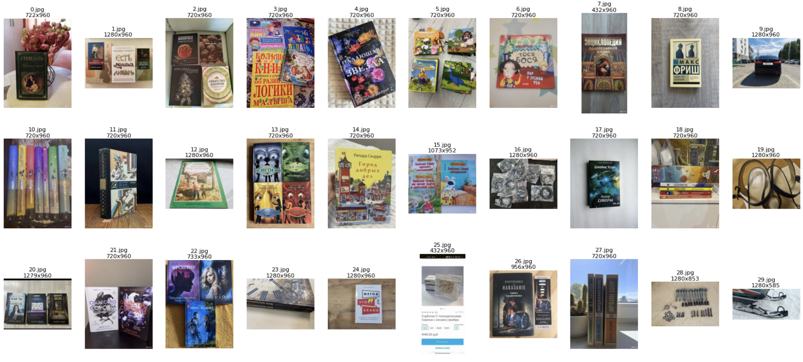
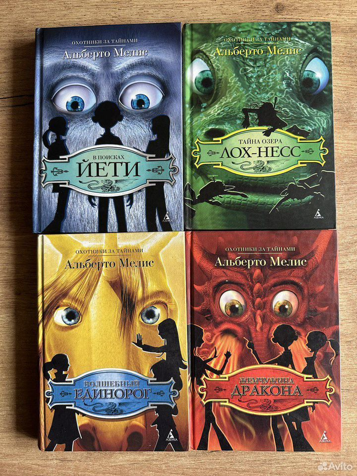
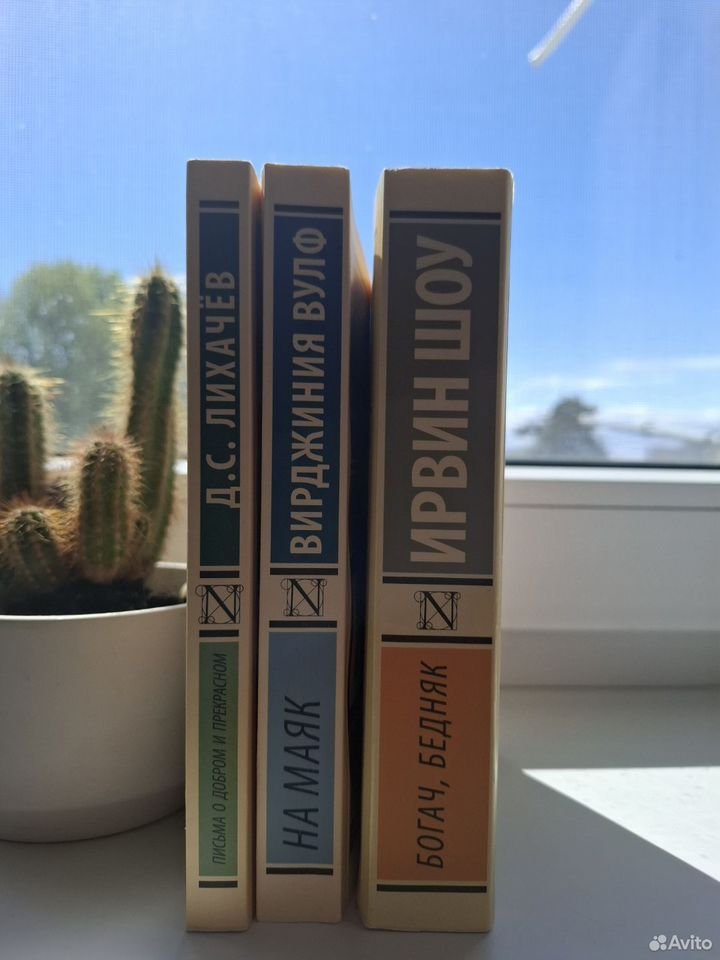
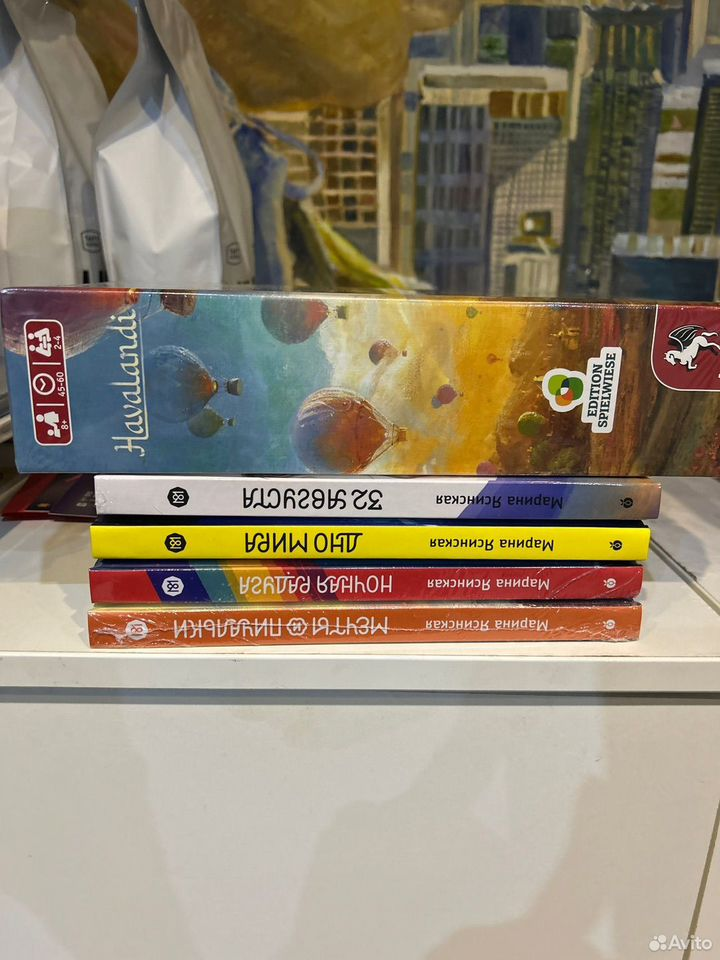
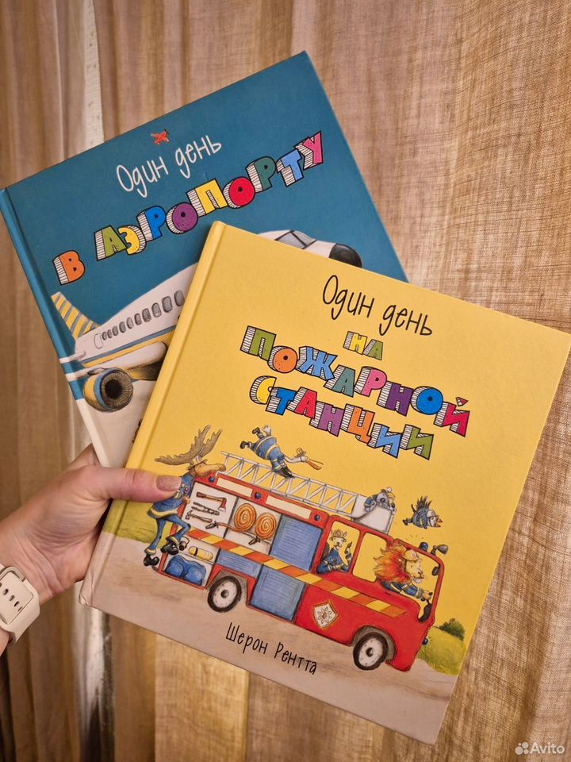
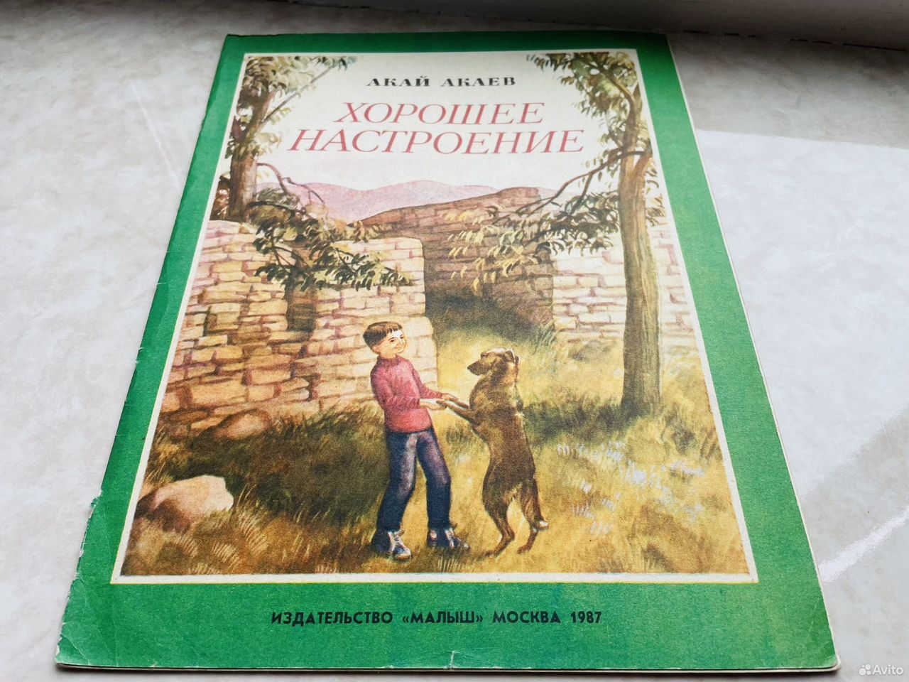
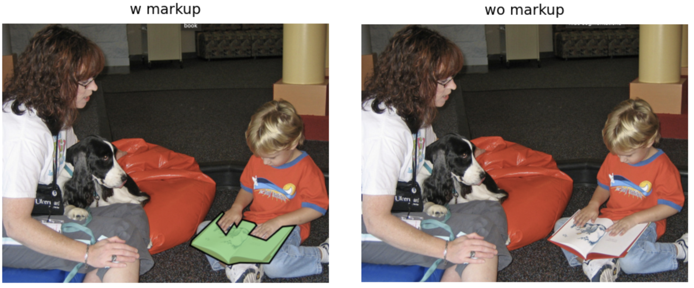

# Book counter

В данной статье описано как решить задачу подсчета книг на изображении, но данный подход можно использовать для других объктов 

## Оглавление

- [Задача](#задача)
- [Цель](#цель)
- [Метрика](#метрика)
- [Анализ данных](#анализ-данных)
    - ["Технический" анализ](#технический-анализ)
    - [Условия съемки](#условия-съемки)
    - [Фон](#фон)
    - [Содержание изображений](#содержание-изображений)
- [Требования к моделе/системе](#требования-к-моделесистеме)
- [Подходы к решению задачи](#подходы-к-решению-задачи)
    - [Эвристика](#эвристика)
        - [Логика](#логика)
        - [Плюсы эвристики](#плюсы-эвристики)
        - [Минусы эвристики](#минусы-эвристики)
    - [Простой детектор(YOLO)](#простой-детекторyolo)
        - [Размышления](#размышления)
        - [Логика](#логика-1)
        - [Плюсы Simple YOLO model](#плюсы-simple-yolo-model)
        - [Минусы Simple YOLO model](#минусы-simple-yolo-model)
        - [Проблемы данного решения](#проблемы-данного-решения)
    - [YOLO + padding](#yolo--padding)
        - [Размышления](#размышления-1)
        - [Гипотеза](#гипотеза)
        - [Пояснение](#пояснение)
        - [Логика](#логика-1)
        - [Плюсы YOLO + padding](#плюсы-simple-yolo-model)
        - [Минусы YOLO + padding](#минусы-simple-yolo-model)
        - [Проблемы данного решения](#проблемы-данного-решения)


## Задача

Определить количество книг на фотографии.

## Цель

Правило размещения на площадке: один товар (например, книга) – одно объявление.

Однако, если книг на продажу несколько, то зачастую, вместо того, чтобы создавать отдельное объявление для каждой книги, продавец выставляет их все сразу в одном объявлении. И прикладывает фотографии, где на одном снимке может быть несколько книг (как от одного, так и от разных авторов). А параметры (автор, название, жанр и т.д.) указывает только для одной из них.

Это сильно замедляет процесс продажи и затрудняет покупателю поиск книги конкретного автора и с конкретным названием.

На помощь приходит DS. Мы можем автоматически

определять, сколько книг продаётся
извлекать параметры (автор, название, жанр и т.д.) каждой из них
и создавать отдельные объявления для каждой книги.
Это облегчит процесс создания объявления для продавца и упростит поиск нужной книги для покупателя. И в итоге, ускорит процесс совершения сделки между ними.

В этом задании вам предлагается начать с первого шага – определить количество книг на фотографии.

## Метрика

Для проверки задания мы будем использовать метрику ```Balanced Accuracy```

## Анализ данных

Посмотрим глазами на изображения)

### "Технический" анализ
**Разрешение и соотношение сторон:** на всех изображениях разное



**Минимальная ширина:** 262px
**Минимальная высота:** 390px

**Разрешение(формат изображений):** ```.jpg```(цветные, RGB)

### Условия съемки
Предположительно, все фото **сняты не на проф. оборудование** из-за специфики платформы "Авито" (продажа б/у товаров), пока не так важно, но мб для дальнейшего анализа поможет.

### Фон
- **Фон** у большинства изображений **неоднородный/сложный**, на заднем фоне может быть, что угодно (ковер, пол и т.д). 


- Также **фона может и не быть**, т.е. на фото может быть только книга


### Содержание изображений
- На фото **может и не быть книг**


- Если книги есть на фото, то они зачастую **на первом плане**.

- На фото может быть **несколько книг**

- На фото книги могут:
    - **лежать обложкой/обложками вверх**, видны полные обложки с названиями и авторами

    

    - **быть выстроенны в ряд**

    

    - **лежать стопкой**

    

    - **лежать хаотично**

    

- Книга может быть **не полностью видна** на фото


- Книги **могут быть перекрыты** другими книгами/предметами



- Книги могут находиться **под различными углами** 



- Книги могут находиться **плотно друг к другу** 


## Требования к моделе/системе
Рассмотрим данную задачу подсчета кол-ва книг на фотографии в рамках **глобальной задачи**. Подсчет кол-ва книг на фотографии - это **первый этап** в пайплайне, решающем проблему "Правило размещения на площадке: один товар (например, книга) – одно объявление".

**Пайплайн выглядит следующим образом (в моем понимании):**
1) **Подсчет** кол-ва книг на фотографии
2) Выделение каждой книги через **детекцию/сегментацию**
3) **Извлечение параметров** (автор, название, жанр и т.д.) каждой из них через **OCR**
4) **Создание отдельного объявления** для каждой книги

***P.S.*** Мне кажется, что 1 и 2 этап можно свести к одному, т.е. через детекцию/сегментацию считать кол-во книг.

Исходя из глобальной задачи модель/система подсчета кол-ва книг на фотографии должна:
- **быстро инференситься довольно быстро** мы же не хотим, чтобы пользователь ждал 5 минут обработку его заявления.
- выдавать высокое качество по ```Balanced Accuracy```, т.е. как минимум мы должны понимать есть ли на фото книга, а вообще должна **точно определять кол-во** книг на фото

## Подходы к решению задачи

### Эвристика

Код реализации лежит в ```nbs/heuristic.ipynb```.

Можно попытаться решить задачу через эвристику.

#### Логика
**Цель:** Найти на изображении все объекты, которые похожи на прямоугольники и подходят по размеру под книгу.

**Основное предположение:** Книга — это объект, который имеет форму, близкую к прямоугольнику, и ее контур хорошо виден на изображении.

#### Плюсы эвристики
- Минимальные вычислительные затраты
- Не требует обучения

#### Минусы эвристики
- Плохая обработка сложных случаев(перекрытия, сложный фон и т.д.)
- Низкая точность
- Необходимость тонкой настройки параметров

### Простой детектор(YOLO)

Код реализации лежит в ```nbs/simple_yolo.ipynb```.

#### Размышления
Первое, что мне пришло в голову исходя из глобальной задачи (решить проблему "Правила размещения на площадке") - это применить для этой задачи **детекторы**. Т.е. в дальнейшем хотим использовать данную модель/систему для разбиения одного размещения с несколькими книгами на несколько размещений по одной книге. 

Почему именно детекторы - потому что мы можем увидеть, что именно модель/система считает за книгу, также есть пул предобученных моделей. 

#### Логика
1) Беру предобученную **YOLO** для детекции (Предобученный детектор можно брать любой, главное, чтобы в датасете, на котором он обучался, был класс "книга")
2) Прогоняем фото через детектор 
3) Ищем детекции с классом соответствющим книге
4) Считаем кол-во детекций (кол-во детекций = кол-ву книг на фото)

На данном этапе я пока **не буду** делать препроцессинг и постпроцессинг.

Буду считать данное решение **baseline**.

#### Плюсы Simple YOLO model
- Небольшие вычислительные затраты
- Не требует обучения
- Меньше зависит от положения книги в кадре

#### Минусы Simple YOLO model
- Недостаточная точность

#### Проблемы данного решения

- Видно, что модель не справляется с ситуациями когда книги лежат **плотно друг к другу**


- Даже в некоторых **простых сценах** детектор не находит книги


- Она не решает проблему, когда все фото это и есть обложка книги, т.е. **нет фона**


- Она не решает проблему, когда книга может быть **не полностью видна** на фото


### YOLO + padding

Код реализации лежит в ```nbs/yolo_padding.ipynb```.

#### Размышления
В ноутбуке ```nbs/simple_yolo.ipynb``` я взял YOLO и просто прогнал через нее изображения и посчитал задетектированные книги, но данный имел свои слабые места описанные **в самом конце ноутбука**. 

Думаю, что стоит все-таки стоит обратиться к **датасету COCO**, чтобы понять какие книги предлагалось найти в датасете COCO. На сайте датасета есть удобный инструмент для просмотра разметки для определенных классов.

[Сайт](https://cocodataset.org/#explore)

Видно, что в датасете все книги **небольшого размера** и не находятся на первом плане.



#### Гипотеза

Если добавить **паддинги**, то модель будет лучше детектировать книги.

#### Пояснение

Т.к. в датасете COCO на изображениях книги **небольшого размера** и не находятся на первом плане (не занимают большую площадь изображения), следует создать для модели "привычные условия", т.е. привести фото к виду фото из датасета COCO.

Если говорить простым языком, то YOLO научилась детектировать небольшие книги и ей надо подавать небольшие книги, чтобы она хорошо их детектировала.

#### Логика
1) Беру предобученную **YOLO** для детекции (Предобученный детектор можно брать любой, главное, чтобы в датасете, на котором он обучался, был класс "книга")
2) Добавляем паддинг к изображению
3) Прогоняем фото через детектор 
4) Ищем детекции с классом соответствющим книге
5) Считаем кол-во детекций (кол-во детекций = кол-ву книг на фото)

#### Плюсы YOLO + padding
- Небольшие вычислительные затраты
- Не требует обучения
- Меньше зависит от положения книги в кадре

#### Минусы YOLO + padding
- Недостаточная точность

#### Проблемы данного решения

- Частично решили проблему, когда книги лежат **плотно друг к другу**


- Она не решает проблему, когда все фото это и есть обложка книги, т.е. **нет фона**


- Она не решает проблему, когда книга может быть **не полностью видна** на фото


